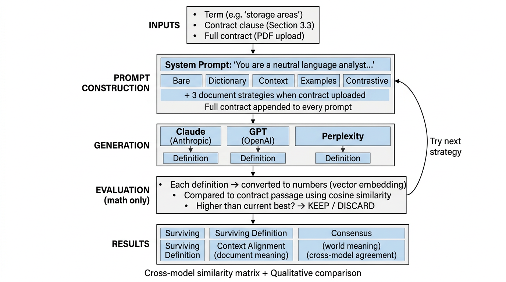

# Ordinary Meaning Tool

A transparent, reproducible protocol for determining the plain-English meaning of legal terms using multiple AI models and mathematical evaluation.



Inspired by Andrej Karpathy's [AutoResearch](https://github.com/karpathy/autoresearch) loop — a system that lets an AI agent autonomously iterate on machine-learning code, keeping only the improvements. This tool adapts that pattern for legal interpretation: instead of optimizing training code, it optimizes definitions of words.

## What it does

You give it a word, the sentence it appears in, and optionally the full contract. The tool asks three AI models — Claude (Anthropic), GPT (OpenAI), and Sonar Pro (Perplexity) — to define that word in plain English. Each model tries eight different prompting strategies. A locked mathematical evaluator picks the best definition from each model. No AI scores another AI's work.

## How the loop works

```
For each model (Claude, GPT, Perplexity):
    For each prompting strategy (bare, dictionary, context, examples, ...):
        1. Generate a definition
        2. Convert the definition to a vector (1,536 numbers)
        3. Convert the contract clause to a vector
        4. Compute cosine similarity between them
        5. If this score > current best → keep it
        6. If not → discard it
    Surviving definition = the one with the highest context alignment
```

The key: the evaluation is pure math. Same inputs always produce the same score. The models generate definitions. A formula evaluates them. The two never mix.

## What it measures

| Metric | What it compares | What it tells you |
|---|---|---|
| **Context Alignment** | Definition vs. the contract clause | Does this definition capture the meaning *in this document*? |
| **Term Alignment** | Definition vs. the bare word | Does this definition match the word's general meaning *in the world*? |
| **Consensus** | Definition vs. other models' definitions | Do the three models *agree with each other*? |

No single winner is declared. All three numbers are shown independently. The interpreter decides.

## Quick start

**Requirements:** Python 3.10+, API keys for OpenAI, Anthropic, and Perplexity.

```bash
# 1. Clone the repo
git clone https://github.com/adanordonez/ordinary-meaning.git
cd ordinary-meaning

# 2. Install dependencies
pip install -r requirements.txt

# 3. Create a .env file with your API keys
echo 'OPENAI_API_KEY=sk-your-key-here' >> .env
echo 'ANTHROPIC_API_KEY=sk-ant-your-key-here' >> .env
echo 'PERPLEXITY_API_KEY=pplx-your-key-here' >> .env

# 4. Run the app
streamlit run app.py
```

The app opens in your browser. Enter a term, paste the clause, optionally upload the full contract (PDF/DOCX/TXT), and click Run.

## Project structure

```
app.py          — Streamlit web interface (main entry point)
prepare.py      — LLM API helpers + embedding math (evaluation logic)
strategies.py   — Prompting strategies and prompt construction
extract.py      — PDF/DOCX/TXT text extraction
input.md        — Default term and context (read by the app)
```

## Prompting strategies

Each model runs through up to eight strategies. When a full document is uploaded, it is appended to every prompt so the model always has the full picture.

| Strategy | What it asks |
|---|---|
| **Bare** | "What does this word mean?" — no context |
| **Dictionary** | "Define this like a dictionary editor" |
| **Context** | "What does it mean in this passage?" |
| **Examples** | "Give examples of what it includes and doesn't" |
| **Contrastive** | "What does it include and exclude?" |
| **Full document** | "Define it based on this entire contract" |
| **Document scope** | "Define it as used in this clause, with the full contract as background" |
| **Document contrastive** | "Include/exclude — point to specific parts of the contract" |

## The math

Evaluation uses [cosine similarity](https://en.wikipedia.org/wiki/Cosine_similarity) on vectors from OpenAI's `text-embedding-3-small` model. The formula:

```
similarity = dot(A, B) / (‖A‖ × ‖B‖)
```

Both the definition and the comparison text (clause or bare term) are converted to 1,536-dimensional vectors. The formula measures how close they are. The result is always between 0 and 1. Higher means more similar in meaning.

This is the same math used in search engines, recommendation systems, and information retrieval. It is deterministic — same inputs, same output, every time.

## Design choices

- **Three providers, not one.** A single model's output is an anecdote. Three independent models converging is evidence.
- **No LLM-based scoring.** Models generate definitions. Math evaluates them. The evaluator cannot be gamed.
- **Full transparency.** Every prompt, every raw output, every score is visible in the UI. Nothing is hidden.
- **No composite score.** Context alignment, term alignment, and consensus are shown independently. The interpreter weighs them.
- **Document injection.** When a contract is uploaded, it is appended to every prompt — even the "bare" strategy — so the model always knows the domain.

## Sample output

Run on "storage areas" from a contractor–subcontractor agreement (Section 3.3):

| Model | Surviving Strategy | Context Alignment | Term Alignment | Consensus |
|---|---|---|---|---|
| Claude Sonnet 4.6 | document_contrastive | 0.6295 | 0.5236 | 0.8913 |
| GPT-5.4 Nano | document_scope | 0.6855 | 0.5105 | 0.8966 |
| Perplexity Sonar Pro | document_scope | 0.6936 | 0.5941 | 0.8960 |

Average cross-model similarity: **0.8946** — all three models converged on the same core meaning.

## Inspiration

This tool adapts [Karpathy's AutoResearch](https://github.com/karpathy/autoresearch) pattern:

| | Karpathy's AutoResearch | This tool |
|---|---|---|
| **Domain** | ML training code | Legal word definitions |
| **What the agent edits** | `train.py` (model architecture, hyperparameters) | Prompting strategies (different ways of asking) |
| **What's locked** | `prepare.py` (evaluation harness) | `prepare.py` (embedding math) |
| **Metric** | val_bpb (lower is better) | Context alignment / cosine similarity (higher is better) |
| **Loop** | Edit code → train → measure → keep or revert | Generate definition → embed → measure → keep or discard |
| **Key difference** | Single score, single model | Three independent scores, three independent models |

## Limitations

- All scoring runs through one embedding model (`text-embedding-3-small`). Blind spots in that model affect scores.
- Cosine similarity measures relatedness, not definition quality. A paraphrase of the clause could score high without being a good definition.
- The AI training data is not curated for legal use. The models reflect how people actually talk, not how editors define words.
- Words change meaning over time. The models reflect current usage.

## License

MIT
